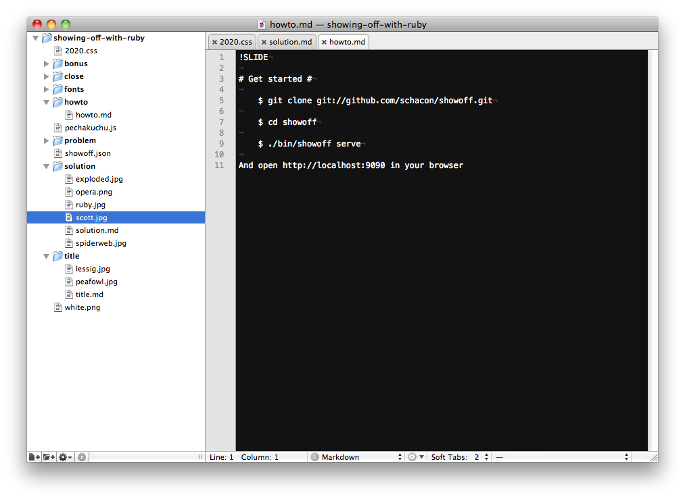

!SLIDE full-page-image

!SLIDE full-page-image

Image courtesy of [Simbolism](http://www.flickr.com/people/simbolism/)

!SLIDE

    @@@ diff
    diff --git a/example/bonus/bonus.md b/example/bonus/bonus.md
    index 7d359ff..3327815 100644
    --- a/example/bonus/bonus.md
    +++ b/example/bonus/bonus.md
    @@ -1,8 +1,7 @@
    -# Easy to add functionality #
    +# Customisable #

    +    @@@ javascript

!SLIDE

# Code highlighting #

    @@@ ruby
    require 'sinatra/base'

    class MyApp < Sinatra::Base
      set :sessions, true
      set :foo, 'bar'

      get '/' do
        'Hello world!'
      end
    end

!SLIDE

# Customisable #

    @@@ javascript
    function twentyTwenty()
    {
      setInterval(function() {
        nextStep();
      }, 20000);
    }

!SLIDE full-page-image

Image courtesy of <a rel="cc:attributionURL" href="http://www.flickr.com/photos/sebjoguet/">Seb Joguet</a> <a rel="license" href="http://creativecommons.org/licenses/by-nc/2.0/">(CC)</a>
