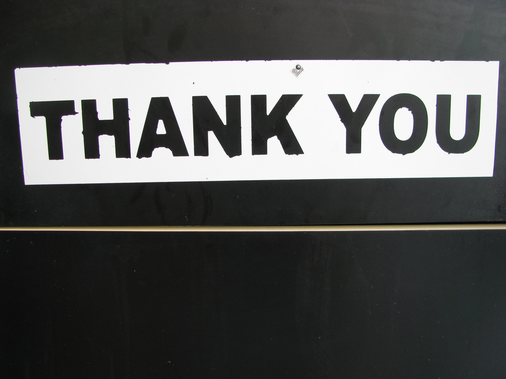

!SLIDE full-page-image

Image courtesy of <a rel="cc:attributionURL" href="http://www.flickr.com/photos/thetruthabout/">TheTruthAbout...</a> <a rel="license" href="http://creativecommons.org/licenses/by-sa/2.0/">(CC)</a>

!SLIDE credits

# Links #

This presentation - <http://github.com/mocoso/showing-off-with-ruby>

Showoff - <http://github.com/schacon/showoff>

Slidedown - <http://github.com/nakajima/slidedown>

Plainview - <http://barbariangroup.com/software/plainview>

Puritan font - <http://readingtype.org.uk/type/puritan.html>

See individual images for links and credits

