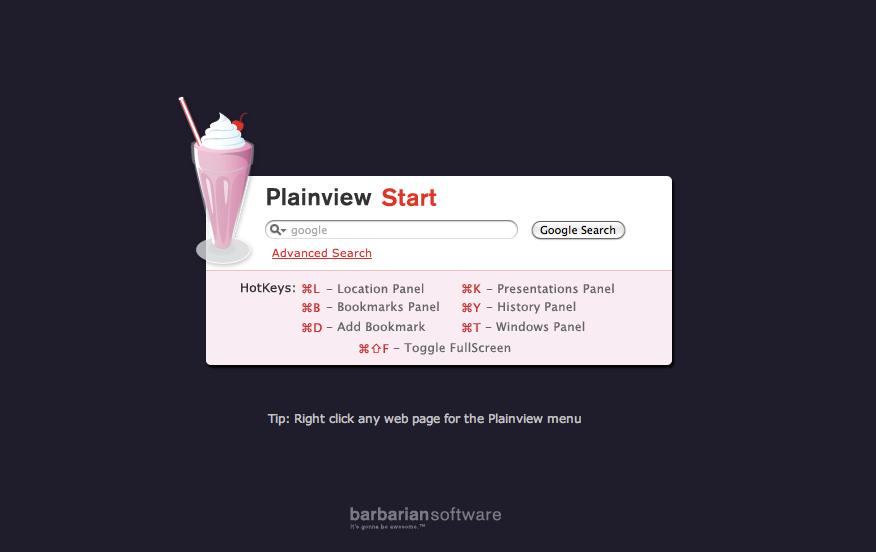

!SLIDE

# Get started #

    $ git clone git://github.com/schacon/showoff.git

    $ cd showoff

    $ ./bin/showoff serve

And open http://localhost:9090 in your browser

!SLIDE full-page-image

!SLIDE full-page-image

Image courtesy of <a rel="cc:attributionURL" href="http://www.flickr.com/photos/jdlasica/">JD Lasica</a> / <a rel="license" href="http://creativecommons.org/licenses/by-nc/2.0/">(CC)</a>
