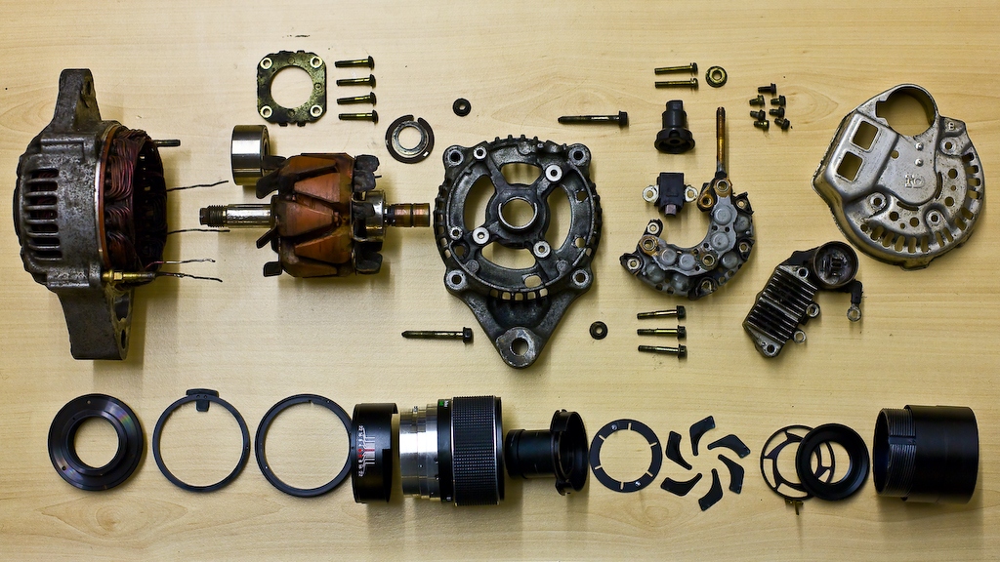
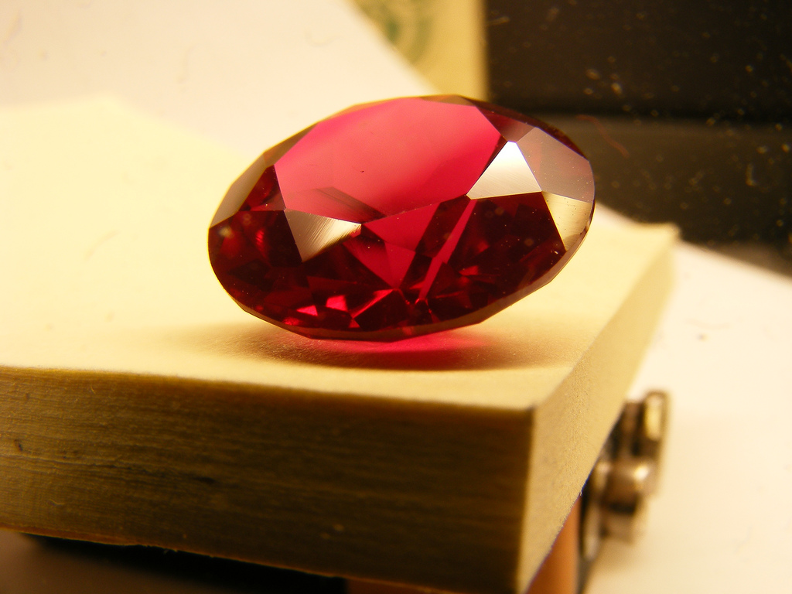

!SLIDE full-page-image

Image courtesy of <a rel="cc:attributionURL" href="http://www.flickr.com/photos/purplemattfish/">purplemattfish</a> <a rel="license" href="http://creativecommons.org/licenses/by-nc-nd/2.0/">(CC)</a>

!SLIDE

# &lt;HTML /> #

!SLIDE full-page-image

Image courtesy of <a rel="cc:attributionURL" href="http://www.flickr.com/photos/fraserspeirs/">Fraser Speirs</a> <a rel="license" href="http://creativecommons.org/licenses/by/2.0/">(CC)</a>

!SLIDE full-page-image

Image courtesy of <a rel="cc:attributionURL" href="http://www.flickr.com/photos/jobafunky/">JOBAfunky</a> <a rel="license" href="http://creativecommons.org/licenses/by-nc-nd/2.0/">(CC)</a>

!SLIDE

# Write slides in markdown #

    
    
    Image courtesy of [rappensuncle](http://www.flickr.com/photos/rappensuncle/146681779/)
    
    # Showing off with Ruby #
    
    ## by Joel Chippindale ##

!SLIDE

# ...and sprinkle on a bit of #

## CSS ##

    @@@ css
    .slide {
      border: 1px solid #fff;
    }

## Javascript ##

    @@@ javascript
    function showFirstSlide() {
      slidenum = 0;
      showSlide();
    }

